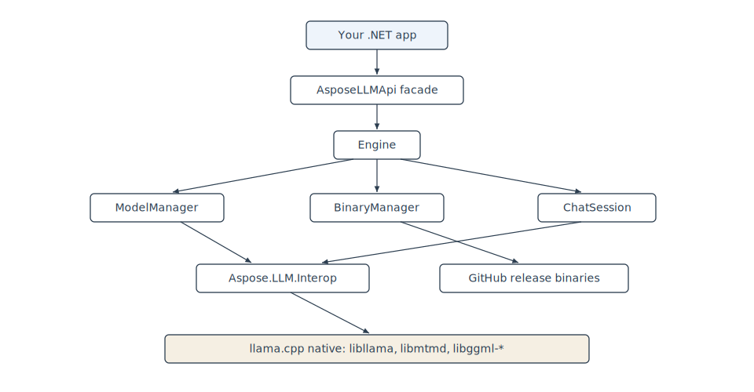
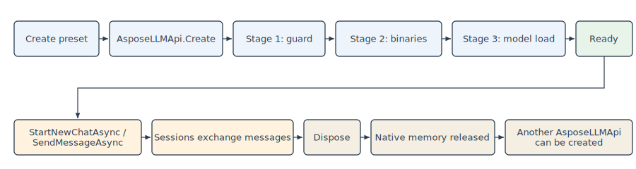

Aspose.LLM for .NET wraps the `llama.cpp` native runtime and exposes it through a managed .NET API. This page describes the layers, what happens when you create an API instance, and how the SDK manages models, native binaries, and memory during its lifecycle.

Read this page before tuning performance, planning an offline deployment, or integrating the SDK into a long-running service.

## Layered architecture



| Layer | Role |
|---|---|
| `AsposeLLMApi` | Public facade. Creates the engine, enforces a single-instance guard, and exposes chat and session operations. |
| `Engine` | Orchestrates model loading, chat session lifecycle, cache cleanup, and session persistence. |
| `ModelManager` | Resolves the model file (local path, Aspose model ID, or Hugging Face repo), downloads it if needed, and loads it into native memory. |
| `BinaryManager` | Downloads and caches the matching `llama.cpp` native binaries from GitHub releases on first use. |
| `ChatSession` | One session per conversation. Holds the KV cache slice, chat history, and current KV position. |
| `Aspose.LLM.Interop` | P/Invoke layer with 225+ bindings to `llama.cpp` and `mtmd`. Hidden from consumers — only `Aspose.LLM.dll` ships in the NuGet package. |
| llama.cpp native | The native runtime: `libllama`, `libmtmd`, and `libggml-*` acceleration backends. Selected per platform at runtime. |

## What happens when you create the API

`AsposeLLMApi.Create(preset)` is a synchronous call that completes three stages before returning control to your code.

### Stage 1. Instance guard

The facade enforces a single-instance guard with `Interlocked.CompareExchange`. A second call while the first instance is alive throws `InvalidOperationException`.

### Stage 2. Native binary deployment

`BinaryManager.EnsureBinariesDeployed()` runs synchronously inside the engine constructor. It:

1. Reads `preset.BinaryManagerParameters.ReleaseTag` (default `b8816` as of v26.5.0).
2. Checks the local cache at `BinaryManagerParameters.BinaryPath` (default: a per-user cache folder).
3. If the required binaries are missing, queries the GitHub release at `github.com/ggml-org/llama.cpp/releases/tag/<ReleaseTag>`.
4. Downloads the asset matching your platform, architecture, and acceleration backend (CUDA / HIP / Metal / Vulkan / CPU).
5. Extracts the archive and deploys `libllama`, `libmtmd`, and `libggml-*` libraries.

On the **first** call, stage 2 makes network requests and may take several minutes depending on bandwidth; payload is typically 100-500 MB.

On subsequent calls for the same release tag and system, stage 2 completes in milliseconds from the local cache.

{}
Behind a corporate proxy or firewall, pre-download the release archive and point `BinaryManagerParameters.BinaryPath` to its location. See the offline deployment use case for details.
{}

### Stage 3. Model load

If the preset specifies a model source, the engine constructor calls `LoadModelAsync(preset)` synchronously:

1. `ModelManager` resolves the model file in this priority order:
   - `BaseModelSourceParameters.ModelFilePath` — explicit local path.
   - `BaseModelSourceParameters.AsposeModelId` — internal Aspose model registry.
   - `BaseModelSourceParameters.HuggingFaceRepoId` + `HuggingFaceFileName` — download from Hugging Face Hub.
2. The model file is loaded into native memory via `llama_model_load_from_file`.
3. If the preset is a vision preset, the `mmproj` projector is loaded next via `mtmd_init_from_file_ptr`.

For a 7B-parameter model in Q4 quantization, stage 3 takes 5-30 seconds on first load and 2-10 seconds on warm cache, depending on disk speed and whether GPU offload is active.

## Memory footprint

An alive `AsposeLLMApi` instance holds the following native allocations:

| Component | Size | Notes |
|---|---|---|
| Model weights | 2-20 GB | Depends on model size and quantization. A 7B Q4_0 model is ~4 GB; a 7B Q8_0 is ~8 GB; a 70B Q4_K_M is ~40 GB. |
| KV cache | 100 MB - 2 GB | Grows with `ContextParameters.ContextSize`, number of active sessions, and KV cache dtype (`TypeK`/`TypeV`). |
| Vision projector | 200 MB - 2 GB | Only for vision presets. Loaded once, shared across sessions. |
| Intermediate buffers | 50-500 MB | Batch buffers, sampler state, tokenizer. |

Both GPU and CPU memory are claimed in proportion to `BaseModelInferenceParameters.GpuLayers`. With `GpuLayers = 0`, allocations are CPU-only. With `GpuLayers = 999` (full offload), weights live on the GPU.

## Lifecycle



The facade implements `IDisposable`. Calling `Dispose`:

1. Unloads the model from native memory.
2. Releases KV cache across all sessions.
3. Resets the single-instance guard so another `AsposeLLMApi` can be created.

Use the `using` pattern to make disposal automatic:

```csharp
using Aspose.LLM;
using Aspose.LLM.Abstractions.Parameters.Presets;

using var api = AsposeLLMApi.Create(new Qwen25Preset());
// ... use the API
// api.Dispose() runs automatically when the block exits.
```

## Threading and concurrency

- Only one `AsposeLLMApi` instance can exist per process at a time. A second `Create` call while the first instance is alive throws `InvalidOperationException`.
- A single instance can host multiple chat sessions. Each session has its own KV cache region and chat history.
- Concurrent access to the **same session** is not supported. Serialize calls to `SendMessageToSessionAsync(sessionId, ...)` for a given `sessionId` in your code.
- Concurrent calls to **different sessions** are safest when serialized at the application level. The native layer shares the model and KV cache pool, and a single inference call holds a native resource.

For request routing in a web service, place `AsposeLLMApi` behind a queue or a single worker, and fan messages out to sessions from there.

## What ships in the NuGet package

Only `Aspose.LLM.dll` is distributed. The dependent assemblies (`Aspose.LLM.Abstractions`, `Aspose.LLM.Core`, `Aspose.LLM.Interop`) are merged into it via ILRepack. Consumers reference one package and one DLL.

Native `llama.cpp` libraries are **not** bundled with the NuGet payload. They are downloaded at first use by `BinaryManager` (stage 2 above).

## What's next

- [Supported presets](/net/product-overview/supported-presets/) — pick a preset that matches your model and hardware.
- [Chat sessions](/net/developer-reference/chat-sessions/) — how sessions are created, used, and disposed.
- [Hello, world!](/net/hello-world/) — a minimal runnable example.
